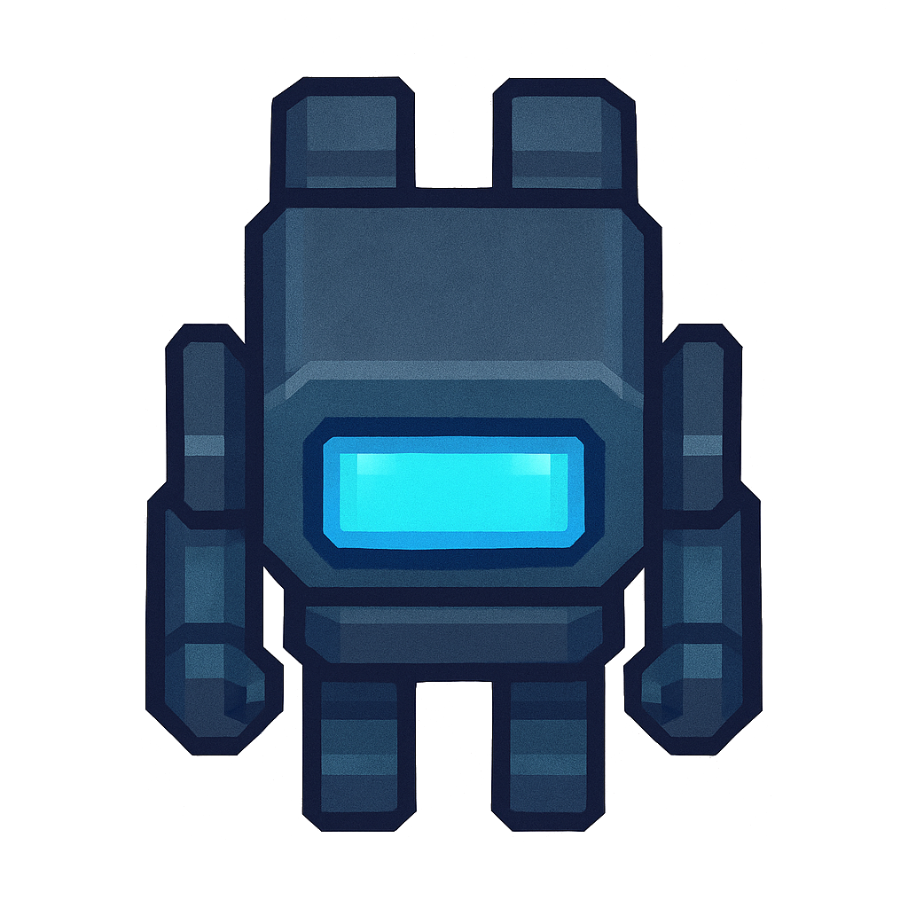

# Procedural Spaceship Generator



A tile-based exploration game where players navigate procedurally generated spaceships, collect resources, and upgrade their equipment.

## Features

- **Procedural Generation**: Unique spaceship layouts with different room types (engineering, cryo chambers, labs, etc.)
- **Resource System**: Collect and manage resources to purchase upgrades
- **Battery Management**: Movement consumes energy - manage your power carefully
- **Interactive Objects**: Over 30 different interactable ship systems and objects
- **Upgrade System**: Permanent upgrades that enhance your capabilities
- **Fog of War**: Unexplored areas remain hidden until visited

## How to Play

### Controls
- **Arrow Keys**: Move your character
- **Space/Enter**: Interact with objects
- **U**: Open upgrade menu
- **R**: Reset to spawn point (when stuck)

### Gameplay Mechanics
- Explore the ship to find resources and equipment
- Manage your battery level - running out returns you to spawn
- Purchase upgrades to improve battery capacity, movement efficiency, and resource gathering
- Different room types contain unique objects and resources

## Development Setup

### Requirements
- Modern web browser (Chrome, Firefox, Edge)
- Node.js (for development/testing)

### Installation
1. Clone the repository:
```bash
git clone git@github.com:ndamiano/unnamed-spaceship-game.git
```
2. Run a local development server:
   - Python 3:
     ```bash
     python3 -m http.server 8000
     ```
   - Node.js (install http-server first):
     ```bash
     npx http-server
     ```
3. Open `http://localhost:8000` in your browser

### Testing
Run tests with:
```bash
npm test
```

## Technical Architecture

### Core Modules
- **Game.js**: Main game loop and initialization
- **Ship.js**: Procedural ship generation and management
- **Player.js**: Player controls, stats, and upgrades  
- **UserInterface.js**: Stats panel and message display
- **EventBus.js**: Central event system for game communication

### Key Systems
- **Tile-based Movement**: Directional collision detection
- **Object Interaction**: Custom interaction logic for each object type
- **Resource Management**: Track and spend resources
- **Upgrade System**: Permanent player improvements

## Asset Credits
All game assets are original creations by the developer.

## Contributing
Pull requests are welcome. For major changes, please open an issue first to discuss what you'd like to change.
